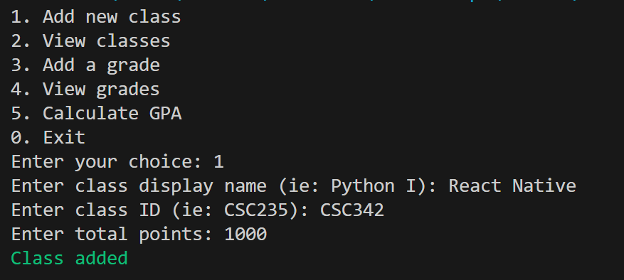
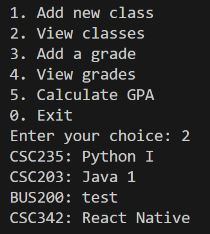
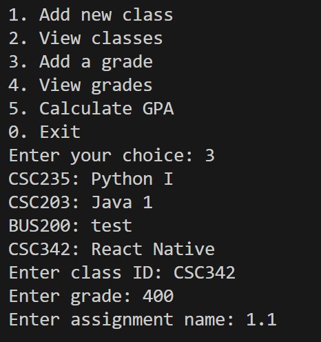
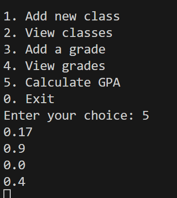

# CSC235 Final

## Objectives
1. Opening screen with a description of the application and instructions
2. User Input
3. Output to the Display
4. Variables with at least two different data types.
5. Command-line Menu choices for the user, or if you do a GUI, then Menu buttons for the user to choose options
6. At least 10 functions or more; some of which take parameters and return values.
7. Use at least one of these 4 data collection types:  List, or Dictionary, or Tuple, or Set
8. Make a program loop using a while, or a for loop.
9. Use at least one Python Package/Library.

## Pictures

  
13.1 Pictures

  
  
  
  

